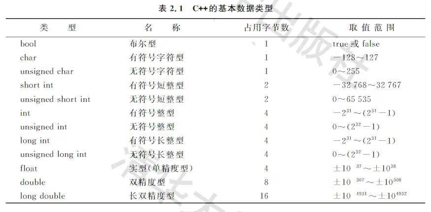

# 数据类型与表达式
## 1、c++的基本数据类型

## 2、常量和变量

常量：在程序运行过程中一直保持不变的量（分为不同类型，例如30、40为整形，30.0、40.0为实型）

变量：在程序运行过程中其值可以改变的量（变量在程序运行中可以赋值，发生变化，在使用前要说明其类型）

变量由标识符命名 标识符由字母、数字、下划线组成，**且第一个字符不能是数字！**

关键字是vc++的语法要求使用的字

变量必须提前定义以分配空间
