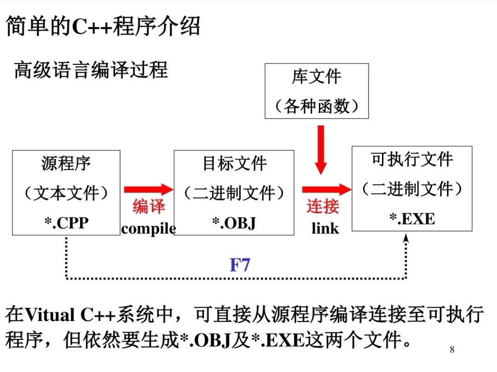

# c++基础知识

## 1、简单c++程序介绍



## 2、二进制数特点

1、加法：逢二加一

0+0=0；1+0=1；0+1=1；1+1=10；

2、减法：借一当二

0-0=0；1-0=1；1-1=0；0-1=1；

3、乘法：0 * 0= 0；1 * 0= 0；1 * 1 = 1；

## c++简单的输入输出

```c++
# include <iostream>
using namespace std;
int main()
{int a,b,c;
cin>>a>>b;
c=a+b;
cout<<c;
return 0;
}


```
