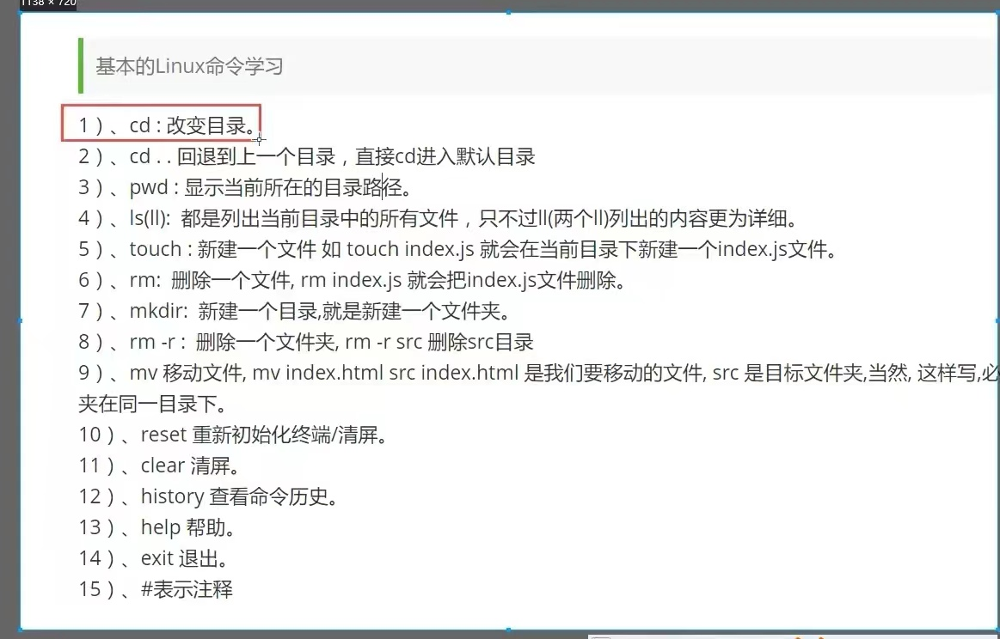

# git的简单使用

## 一、基本的Linux命令学习

## 二、将代码推到本地再推到远端

1、git add.将状态变为Staged（入库）
2、git commit将代码暂存本地 
3、git push将本地代码推到远程
4、git rm移出版本库
5、git checkout 弃修改过
6、git reset HEAD filename取消暂存

## 三、查看文件状态

**git status [filename]**查看文件状态

Staged 已入库 Modified 被修改过 Untracked 不在库中

