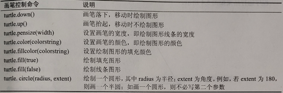
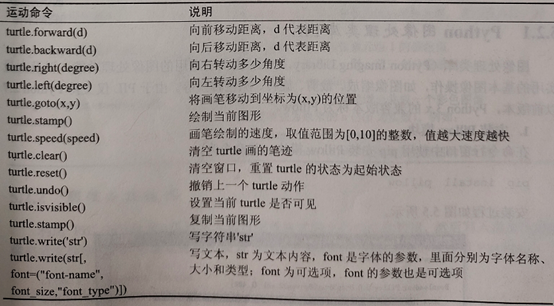
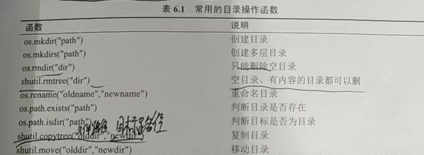
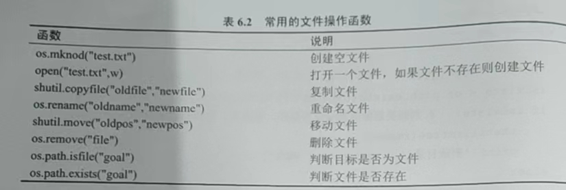
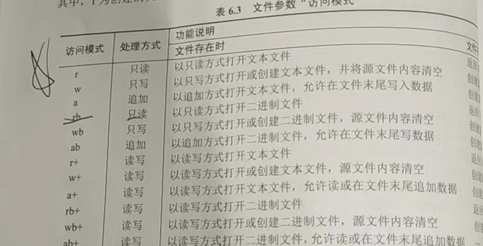

# python 作业

## 1、由用户从键盘上输入一个年份值和一个月份值，输出该月有多少天

```python
print("输入年份")
a = eval(input()) # eval（input（））为输入实数
print("输入月份")
b = eval(input())
if b in (1,3,5,7,8,10,12) :
    print("31天")
elif b in (4,6,9,11) :
    print("30天")
elif b==2 and a%4==0 and a%100!=0 or a%400==0 :
    print("29天")
else :
    print("28天")

```

## 2、使用循环嵌套打出字母金字塔图形

```python
n=0
str=['a','b','c','d','e','f','g','h','i','j','k','l','m','n','o','p'];
for i in range(1,17,2): # 1为起始数，17为终止数（取不到），2为步数
    m=7-i
    print(' '*m,end="")
    for f in range(1,17):
        if f>i:
            continue
        print(str[n] ,end=" ")
        n = n + 1
    print('')
 ```

## 3、定义一个函数，输出100以内是3的倍数的所有偶数

 ```python
def f():
    for i in range(1,101) :
        if i%6==0 :
         print(i,' ',end="")
print(f())
```

## 4、定义函数，由用户输入三角形的三条边长，输出该三角形的面积

 ```python
import math
global a,b,c
print("请输入三角形的三边，将求出其面积")
a=eval(input())
b=eval(input())
c=eval(input())
def f(x,y,z) :
    p=(x+y+z)/2
    S=math.sqrt(p*(p-x)*(p-y)*(p-z))
    print(S)
f(a,b,c)
```

## 5、一个正整数n，若为偶数，则变为n/2，若为奇数，则乘三加1.不断重复这样的运算，经过有限步后，必然会得到1，要求编写函数输出100以内所有整数按照以上规律经多少次可变为1

```python
def f(a):
     b = 0
     c = a
     while a!=1:
        if a%2==0:
            a=a/2
        else :
            a=3*a+1
        b=b+1
     print(c,'的次数为',b)
for i in range(1,101):
    f(i)
```

## 6、用递归技术实现输出斐波那契数列的前三十项(每行五项）

```python
a=0
b=1
sum=0
for i in range(6):
        for j in range(5):
            a, b = b, a + b
            sum = a
            print(sum,'',end='')
```

## 7、编写密码验证程序，用户只有三次输入错误密码的机会

```python
print('请输入四位数密码，您只有三次机会')
e=0
for e in range(1,4):
    a=eval(input())
    b=eval(input())
    c=eval(input())
    d=eval(input())
    if a==1 and b==2 and c==3 and d==4:
        print("开锁成功")
    elif e==3:
         print('三次密码都错误，开锁失败')
```

## 8、猜数游戏，随机产生一个100以内的随机整数，由用户来猜，根据用户所猜数据进行提示：“太大了”、“太小了”或者“猜对了”，用户最多5次机会

```python
import random
print('请猜一个100以内的数，只有五次机会哦！')
a=random.randint(1,101)
for i in range(5):
    b=eval(input())
    if b>a:
        print('太大了')
    elif b<a:
        print('太小了')
    else :
        print('猜对了')
        break
print('啊哦，没机会喽！答案是,',a)

```

## 9、分宿舍。假设班级有30位同学，男生20人，女生10人，男生宿舍5间，女生宿舍3间，请编程随机为每位同学分配宿舍并输出分配结果

```python
import random
def apex(num,list1):
    each=[]
    for i in range(num):
        b=random.choice(list1)
        t=chr(64+b)
        each.append(t)
        list1.remove(b)
    return each
def lol(c,g):
    a=[]
    q=0
    for i in range(1, g):
        t = random.randint(1, (c- q) - (g- i))
        a.append(t)
        q = q + t
    a.append(c-q)
    return a
print("男生寝室名单：")
num=4
list1 = list(range(1, 21))
for k in range(1,6):
    each=apex(num,list1)
    list1=[i for i in list1 if i not in each]
    print("%d号寝室名单如下："%k)
    print(each)
print("女生寝室名单：")
w=5
while w>4:
    list3 = lol(10,3)
    w = max(list3)
list2 = list(range(1,11))
for e in range(1,4):
    p= random.choice(list3)
    str = apex(p, list2)
    list2 = [i for i in list2 if i not in str]
    print("%d号寝室名单如下：" %e)
    print(str)
```

## 10、设计一个Circle(圆类)，该类中包含属性radius（半径），还包括get_perimeter（）（求周长）和get_area（）（求面积）共两个方法。设计完成后，创建Circle类的对象求圆的周长和面积

```python
print('请输入圆的半径')
a=eval(input())
class Circle:
    radius = a
    def get_perimeter(self,b):
        self.l = 2 * 3.14 * b
        return self.l
    def get_area(self,d):
        self.s = 3.14 * d * d
        return self.s
c = Circle()
l = c.get_perimeter(a)
s = c.get_area(a)
print('圆的周长为',l)
print('圆的面积为',s)
```

## 11、设计一个Course（课程）类，该类中包括number（编号），那么（名称），teacher（任课教师），location（上课地点）共四个属性，其中location是私有属性，还包括show_info（）（显示课程信息）方法。设计完成后，创建Course对象显示课程的信息

```python
class Course:
       number = '01'
       name = '数学'
       teacher = '郭双冰'
       __location = '4楼合2'
       def show_info(self):
           print(self.number," ",self.name,' ', self.teacher, ' ',self.__location)
c = Course()
c.show_info()
```

## 13、模块调用

先创建一个文件名为shuxue.py的模块文件

```python
def sum(a , b):
    s = a + b
    return s
def sub(a , b):
    s = a - b
    return s
def cheng(a , b):
    s = a * b
    return s
def chu(a , b):
    s = a / b
    return s
```

随后在新文件中调用

```python
import shuxue
s = shuxue.sum(1,2)
print(s)
a = shuxue.sub(5,2)
print(a)
c = shuxue.cheng(3,4)
print(c)
d = shuxue.chu(8,4)
print(d)
```

## 13、创建一个商店类，含有商品名称与单价，并且有金额计算方法

```python
class store:

     def __init__(self,name,price):
         self.name = name
         self.price = price

     def money(self):
         return self.price

     def prnid(self):
         print("名称",self.name,'价格',self.price)

g1 = store('牛奶',10)
g2 = store('面包',5)
g3 = store('鸡蛋',1.5)

g1.prnid()
g2.prnid()
g3.prnid()

m = g1.price + g2.price + g3.price
print('总价为：',m)
```

## 14、创建一个窗体，窗体中间有一个按钮，单击该按钮后，就会弹出一个新的窗体，要求弹出窗体的名称为“这是第i个窗体”位置在屏幕上平铺（不重叠），最多可单机出现5个

```python
import tkinter
win1 = tkinter.Tk()
win1.title("主窗体")
win1.geometry("200x200+500+500")
i = 0
def mClick():
    win2 = tkinter.Tk()
    global i
    i = i + 1
    if i == 5:
        Btn["state"] = "disabled"
    win2.title("窗口"+str(i) )
    win2.geometry('250x100+'+str(i*250)+"+100")
Btn = tkinter.Button(win1, text = '单鸡我！',command =mClick)
Btn.pack()
win1.mainloop()

```

## 15、创建一个窗口，内含加法计算器

```python
import tkinter
from tkinter import *
root = Tk()
root.title("加法计算器")
root.geometry("350x350")
txt1 =IntVar()
txt2 = IntVar()
txt3 = IntVar()
str = Label(root,text='+',font="16")
def mClick():
    txt3.set(txt1.get()+txt2.get())
e1 = Entry(root,textvariable = txt1,width = 4,font=('宋体','16'))
e2 = Entry(root,textvariable = txt2,width = 4,font=('宋体','16'))
e3 = Entry(root,textvariable = txt3,width = 4,font=('宋体','16'))
b1 = Button(root,text = "=",command = mClick )
e1.grid(row=0,column=0)
str.grid(row=0,column=1)
e2.grid(row=0,column=2)
b1.grid(row=0,column=3)
e3.grid(row=0,column=4)

root.mainloop()
```

## 16、单选按钮组件

```python
from tkinter import *
import tkinter as tk

win = Tk()
win.geometry('700x700')
win.title('你最喜欢的编程语言是')

txt = StringVar()
txt1 = StringVar()
txt.set("请选择你最喜欢的语言")
lab = Label(win,textvariable = txt,relief = 'ridge',width = 30)
l1 = Label(win,textvariable = txt1,font = ("宋体",'18'),width = 30)

a = ["c++","python","java","c语言"]

def radcall():
    radSel = radVar.get()
    if radSel == 0:
        txt.set(a[0])
        txt1.set("A")
    elif radSel == 1:
        txt.set(a[1])
        txt1.set("B")
    elif radSel == 2:
        txt.set(a[2])
        txt1.set("C")
    elif radSel == 3:
        txt.set(a[3])
        txt1.set("D")
    print(radVar.get())

radVar = tk.IntVar()
for i in range(4):
    curRad = tk.Radiobutton(win,text = a[i],variable = radVar,value = i,command = radcall)
    curRad.grid(row = i+2,column = 5,sticky = tk.S)

lab.grid(row = 0,column = 5,columnspan = 3)
l1.grid(row = 1,column = 5)

win.mainloop()

```

## 17、单击按钮计数器

注意函数内用config修改标签内容

txt1.get（）的是字符串，想使用加法得在前面加int

```python
from tkinter import *
win = Tk()
win.geometry('500x500')
win.title('按钮点击计数器')
txt1 = IntVar()
txt2 = IntVar()
txt1.set('0')
def mClick():
    txt1.set(str(int(txt1.get() + 1)))
    l1.config(text = txt1.get())
l1 = Label(win,text = txt1.get(),font = ('宋体','30'))
b1 = Button(win,text = '点我试试看',command = mClick)

l1.grid(row = 0,column = 0)
b1.grid(row = 0,column = 1)

win.mainloop()

```

## 18、文本框复制到标签

```python
from tkinter import *
win = Tk()
win.title("单击获取内容")
win.geometry('500x500')
txt2 = StringVar()
def copy():
    l1.config(text = txt2.get())
l1 = Label(win,text = "标签",font=('宋体','16'))
e1 = Entry(win,textvariable = txt2,width = 16,font = ('宋体','16'))
b1 = Button(win,text = '单击我',command = copy )

l1.grid(row = 0,column = 0)
e1.grid(row = 2,column = 0)
b1.grid(row = 1,column = 0)

win.mainloop()

```

## 小提示：按钮里面command后若想调用类用 lambda : 类名（self.窗体名）

## turtle(海龟)





## 19、用turtle（海龟）画同心圆

```python

import turtle
import time

a = 10

turtle.color('red')

for n in range(6):
    turtle.down()
    turtle.circle(a)
    turtle.speed(10)
    turtle.up()
    turtle.goto(0,0 - a)
    a = a + 10

time.sleep(2)

```

## 20、用turtle（海龟）画不规则圆

```python

import turtle
import time

a = 100

for n in range(1,201):
    turtle.forward(a)
    turtle.left(67)
    turtle.speed(10)
time.sleep(2)

```

## 21、图像的打开与关闭

```python

import tkinter as tk
from PIL import Image, ImageTk

win = tk.Tk()
win.title('图像显示')
win.geometry('300x300')

can = tk.Canvas(win,bg = 'white',height = '300')

image = Image.open(r"图片路径") # r的目的是排除路径中转义字符
img = ImageTk.PhotoImage(image) # PhotoImage：获取图像像素
can.create_image("160",'120',image = img) # 将图像添加到画布组件上
can.pack()

win .mainloop()

```

## 22、建立图像的缩略图

### PIL图像对象的thumbnail(size)方法将图像转化为由元组参数设定大小的缩略图

```python

import tkinter
from PIL import Image,ImageTk

win = tkinter.Tk()
win.title('建立图像缩略图')
win.geometry('200x200')

def imgshow():
    size = (64,64)      #设置缩略图尺寸的元组参数
    img = Image.open('文件地址')
    img.thumbnail(size)
    img.save('文件名',"JPEG")  #保存缩略图
    photo = ImageTk.PhotoImage(file = '文件名')
    l1 = tkinter.Lable(win,image = photo)
    l1.pack()
    lable.image = photo

tkinter.Button(win,text = '建立图像缩略图'，command = imgshow).pack()
win.mainloop()

```

## 23、增强图像处理

### PIL中应用filter方法的ImageFilter.EDGE_ENHANCE属性可以将图像对比度增强

```python

import tkinter
from tkinter import Lable
from PIL import Image, ImageTk, ImageEnhance, ImageFilter

win = tkinter.Tk()
win.title('增强图像')
win.geometry('400x200')

photo = Image.open('文件地址')
img1 = ImageTk.PhotoImage(photo)  # 获取图像像素
l1 = Lable(win,image = img1)    #   显示原图

def imgshow():
img = photo.filter(ImageFilter.EDGE_ENHANCE)
    img2 = ImageTk.Photo(img)   #   获取图像像素
    l2 = Lable(win,image = img2).grid(row = 1,columnn = 1) # 显示增强后的图
    l2.image = img2

b1 = tkinter.Button(win,text = '增强图像处理',command = imgshow)

b1.grid(row = 0,column = 0,columnspan = 2)
l1.grid(row = 1,column = 0)

win.mainloop()

```

## 24、Open CV 数字图像处理

### 1、读取图像函数imread（）

### 2、显示图像函数 imshow（）

### 3、保持窗体函数的函数 waitKey（）

### 4、保存图像函数 imwrite（）

## 25、文件目录函数

### 1、常用的目录操作函数



### 2、常用的文件操作函数



### 3、文件参数“访问模式”



## 26、文件的读写操作

### 需要导入os模块

### 1、打开和关闭文件

创建一个文件并打开

打开：f = open(文件名，访问模式)

关闭：f.close(文件名，访问模式)

### 2、读取文件操作

读取文件内容：f.read()

逐行读取文件内容：f.readline（）

一次读取所有行内容：f.readlines()

### 3、写入文件操作

向文件中写入数据：f.write('文件内容')

### 4、二进制文件的读写

以rb+或wb+模式调用open()函数打开文件，可以对二进制文件进行读写操作

## 27、编写一个excel,包含：姓名，学号，英语，数学，计算机的成绩。(这个直接自己打一个excel，不用把它编程一个程序)编一个程序计算成绩的平均值

```python

import xlrd
import xlwt
import xlutils.copy
workbook = xlrd.open_workbook(r'E:\\Python作业\\2.xls')

table = workbook.sheet_by_index(0)
nrows = table.nrows
ncols = table.ncols
cell_C2 = table.cell(1,2).value
cell_D2 = table.cell(1,3).value
cell_E2 = table.cell(1,4).value
print(cell_C2)
print(cell_D2)
print(cell_E2)
a=(cell_C2+cell_D2+cell_E2)/3
wt = xlutils.copy.copy(workbook)
sheets = wt.get_sheet(0)
sheets.write(1, 5, a)
wt.save(r'E:\\Python作业\\2.xls')

```

## 28、简易商品管理器

 ```python

 import tkinter

win=tkinter.Tk()
win.title('窗体')
win.geometry('800x600')

d={'电视机':'2500元'}

l0=tkinter.Label(win,width=15,font='song-20',text='查询商品名称')
l0.grid(row=1,column=0)
t0=tkinter.StringVar()
e0=tkinter.Entry(win,width=10,font='song-20',textvariable=t0)
e0.grid(row=1,column=1)

l1=tkinter.Label(win,width=15,font='song-20',text='显示商品价格')
l1.grid(row=1,column=2)
t1=tkinter.StringVar()
e1=tkinter.Entry(win,width=10,font='song-20',textvariable=t1)
e1.grid(row=1,column=3)

def f1():
    x0=t0.get()
    jian=d[x0]
    t1.set(jian)
tkinter.Button(win,text='查询',command=f1).grid(row=1,column=4)

l2=tkinter.Label(win,width=15,font='song-20',text='输入商品名称')
l2.grid(row=2,column=0)
t2=tkinter.StringVar()
e2=tkinter.Entry(win,width=10,font='song-20',textvariable=t2)
e2.grid(row=2,column=1)

l3=tkinter.Label(win,width=15,font='song-20',text='输入调整价格')
l3.grid(row=2,column=2)
t3=tkinter.StringVar()
e3=tkinter.Entry(win,width=10,font='song-20',textvariable=t3)
e3.grid(row=2,column=3)

def f2():
    x2=t2.get()
    x3=t3.get()
    d[x2]=x3
tkinter.Button(win,text='修改',command=f2).grid(row=2,column=4)

l4=tkinter.Label(win,width=15,font='song-20',text='输入新增商品名称')
l4.grid(row=3,column=0)
t4=tkinter.StringVar()
e4=tkinter.Entry(win,width=10,font='song-20',textvariable=t4)
e4.grid(row=3,column=1)

l5=tkinter.Label(win,width=15,font='song-20',text='输入商品价格')
l5.grid(row=3,column=2)
t5=tkinter.StringVar()
e5=tkinter.Entry(win,width=10,font='song-20',textvariable=t5)
e5.grid(row=3,column=3)

def f3():
    x4=t4.get()
    x5=t5.get()
    d[x4]=x5
tkinter.Button(win,text='添加',command=f3).grid(row=3,column=4)

win.mainloop()

```

## 29、幸运大转盘

```python

import tkinter
import time
import threading

root = tkinter.Tk()
root.title('幸运大转盘抽奖游戏')
root.minsize("300","300")

btn1 = tkinter.Button(text = '奔驰',bg = 'red')
btn1.place(x = 20,y = 20,width = 50,height = 50)

btn2 = tkinter.Button(text = '宝马',bg = 'white')
btn2.place(x = 90,y = 20,width = 50,height = 50)

btn3 = tkinter.Button(text = '奥迪',bg = 'white')
btn3.place(x = 160,y = 20,width = 50,height = 50)

btn4 = tkinter.Button(text = '日产',bg = 'white')
btn4.place(x = 230,y = 20,width = 50,height = 50)

btn5 = tkinter.Button(text = '宾利',bg = 'white')
btn5.place(x = 230,y = 90,width = 50,height = 50)

btn6 = tkinter.Button(text = '劳斯',bg = 'white')
btn6.place(x = 230,y = 160,width = 50,height = 50)

btn7 = tkinter.Button(text = '奇瑞',bg = 'white')
btn7.place(x = 230,y = 230,width = 50,height = 50)

btn8 = tkinter.Button(text = '吉利',bg = 'white')
btn8.place(x = 160,y = 230,width = 50,height = 50)

btn9 = tkinter.Button(text = '大众',bg = 'white')
btn9.place(x = 90,y = 230,width = 50,height = 50)

btn10 = tkinter.Button(text = '沃尔沃',bg = 'white')
btn10.place(x =20 ,y = 230,width = 50,height = 50)

btn11 = tkinter.Button(text = '红旗',bg = 'white')
btn11.place(x = 20,y = 160,width = 50,height = 50)

btn12 = tkinter.Button(text = '长城',bg = 'white')
btn12.place(x = 20,y = 90,width = 50,height = 50)

#将所有选项组成列表
carlist = [btn1,btn2,btn3,btn4,btn5,btn6,btn7,btn8,btn9,btn10,btn11,btn12]
#是否开始循环的标志
isloop = False
def round():
    #判断是否开始循环
    if isloop == True:
        return
#初始化计数变量
    i = 0
# 死循环
    while True:
        time.sleep(0.1)
        #将所有组件背景变为白色
        for x in carlist:
            x['bg'] = 'white'
        # 将当前数值对应的组件变色
        carlist[i]['bg'] = 'red'
        i +=1   #变量+1
        # 如果i大于最大索引则直接归零
        if i >= len(carlist):
            i = 0
        if functions == True:
            continue
        else :
            break

#"开始"按钮事件：建立一个新线程的函数
def newtask():
    global isloop
    global functions
    # 建立新线程
    t = threading.Thread(target = round)
    # 开启线程运行
    t.start()
    # 设置程序开始的标志
    isloop = True
    # 是否运行的标志
    functions = True

# "停止"按钮事件：停止循环
def stop():
    global isloop
    global functions

    functions = False
    isloop = False

# "开始/停止"按钮
btn_start = tkinter.Button(root,text = '开始',command = newtask)
btn_start.place(x = 90,y = 120,width = 50,height = 50)

btn_stop = tkinter.Button(root,text = '停止',command = stop)
btn_stop.place(x = 160,y = 120,width = 50,height = 50)

root.mainloop()

```

## 30、异常的传递

```python

 def get_width():
     num = int(input("请输入除数："))
     width_len = 10 / num
     return width_len

 def calc_area():
     width_len = get_width()
     return width_len*width_len

 def show_area():
     try:
         area_val = calc_area()
         print(f"正方形的面积是：{area_val}")
     except Exception as err:
         print("捕获到异常:",err)

 show_area()

```

## 31、套接字scoket程序设计

服务器端

```python

from socket import *
host = "127.0.0.1"
port = 4321
addr = (host,port)
ss = socket(AF_INET,SOCK_STREAM,0)
ss.bind(addr)
ss.listen(10)
while True:
    print("等待客户机连接……\n")
    cs,caddr = ss.accept()
    print("连接的客户机来自于：",caddr)
    str = "欢迎访问本服务器！"
    cs.sendall(bytes(str,"utf-8"))
    msg = cs.recv(1024).decode()
    print("接收客户机信息：",msg)
    cs.close()
ss.close()

```

客户端

```python

from socket import *
import tkinter
from tkinter import scrolledtext
win = tkinter.Tk()
win.title("客户端程序")
monty = tkinter.LabelFrame(win,text="接收信息")
monty.grid(column=1,row=0,padx=10,pady=10)
scrolW = 60
scrolH = 5

txt_recv = scrolledtext.ScrolledText(monty,width=scrolW,height=scrolH)
txt_recv.grid(column=0,columnspan=3)
def conn():
    host = "127.0.0.1"
    port = 4321
    addr = (host, port)
    cs = socket(AF_INET,SOCK_STREAM,0)
    cs.connect(addr)

    data = cs.recv(1024).decode()
    msgcontent = "接收到服务器发来的信息：\n"
    txt_recv.insert("end",msgcontent+data,"green")
    str = "已收到服务器发来的信息！"
    cs.sendall(bytes(str,"utf-8"))
    cs.close()
action = tkinter.Button(monty,text="连接服务器",command=conn)
action.grid(column=2,row=1)
win.mainloop()

```

## 32、关于UDP的网络程序设计

服务器端

```python

 from socket import *
 s = socket(family=AF_INET,type=SOCK_DGRAM)
  s.bind(("127.0.0.1",10021))
 print("服务器准备就绪，等待连接……")
 while True:
     data,addr = s.recvfrom(1024)
     print("Received from %s:%s."%addr)
     s.sendto(data.decode("utf-8").upper().encode(),addr)

```

客户机端

```python

 from socket import *
 udp_socket = socket(AF_INET,SOCK_DGRAM)
 dest_addr = ("127.0.0.1",10021)
 while True:
     send_data = input("请输入要发送的数据：")
     if not send_data or send_data=='quit':
         break
     udp_socket.sendto(send_data.encode("utf-8"),dest_addr)
     recv_data = udp_socket.recvfrom(1024)
     print(recv_data[0].decode(),recv_data[1])
 udp_socket.close()
